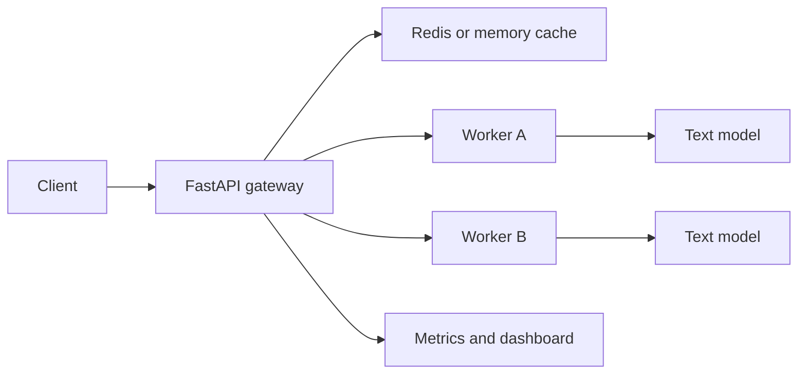

# Architecture notes

ModelMesh is an ML systems project. The model is intentionally small so the repo can focus on serving behavior: routing, caching, retries, observability, and benchmark evidence.

## Request path

1. The client sends text to `POST /predict`.
2. The gateway checks the prediction cache using the input text as the cache identity.
3. On a miss, the gateway asks the worker pool for candidates.
4. The selected worker returns a prediction with label, score, model version, and worker id.
5. The gateway records latency, cache hits, worker errors, and worker health.

## Routing

The gateway supports two routing modes:

- `round_robin` for a simple baseline.
- `load_aware` for routing based on failures, in-flight requests, and recent latency.

The benchmark runner uses both modes against the same slow-worker scenario so the difference is measurable.

## Training

`training/train_text_model.py` trains the tiny text model with PyTorch. On Apple Silicon it uses `mps`, and it exits instead of silently falling back to CPU unless `--allow-cpu` is passed.

The trained artifact is plain JSON so the worker can load it without depending on PyTorch at inference time.
