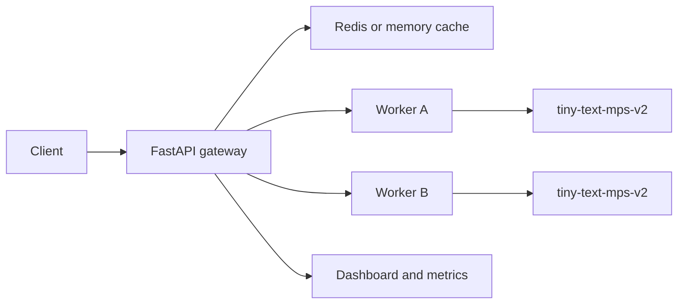

# ModelMesh report

## Summary

ModelMesh is a compact ML inference mesh. It trains a small model locally on Apple Silicon, serves it through multiple workers, routes requests through a gateway, caches repeated predictions, records metrics, and demonstrates recovery from slow or failing workers.

The project is built to show ML systems behavior, not just model training.

## What it does

A client sends text to:

```text
POST /predict
```

The gateway checks cache first. On a cache miss, it selects a worker, sends the request, retries if needed, records latency and worker state, and returns the model prediction.

The dashboard shows:

- request count
- cache hit rate
- p50 and p95 latency
- worker failures
- in-flight requests
- delay and fail-rate controls

## Architecture



The gateway supports two routing strategies:

- `round_robin`: simple baseline.
- `load_aware`: ranks workers by failures, in-flight requests, and recent latency.

## Training results

Latest MPS training run on an M3 Pro:

| Metric | Value |
| --- | ---: |
| Model type | mlp_text_classifier |
| Device | mps |
| Epochs | 260 |
| Train examples | 3,276 |
| Test examples | 820 |
| Features | 140 |
| Hidden units | 16 |
| Parameters | 2,273 |
| Train time | 0.3991 s |
| Examples/sec | 2,134,408.08 |
| Train accuracy | 1.0 |
| Test accuracy | 1.0 |

The training script refuses CPU by default, so it will not silently fall back to a slow CPU run.

## Model evaluation

The model was also evaluated on a handwritten challenge set with mixed healthy and risky signals.

| Metric | Value |
| --- | ---: |
| Examples | 16 |
| Correct | 16 |
| Accuracy | 1.0 |

Confusion matrix:

| Expected | Predicted healthy | Predicted risky |
| --- | ---: | ---: |
| healthy | 7 | 0 |
| risky | 0 | 9 |

There were no misses on this challenge set. The set is small and handwritten, so the result is treated as a regression check rather than a broad NLP claim.

## Benchmark results

Latest local scenario run:

| Scenario | RPS | p50 ms | p95 ms | Cache hits | Failures |
| --- | ---: | ---: | ---: | ---: | ---: |
| cache enabled | 728.95 | 5.01 | 52.04 | 72 | 0 |
| cache disabled | 185.7 | 41.1 | 53.09 | 0 | 0 |
| slow worker, round-robin | 187.36 | 57.79 | 111.91 | 0 | 0 |
| slow worker, load-aware | 688.48 | 5.21 | 111.9 | 0 | 0 |
| dead worker recovery | 707.98 | 11.37 | 28.93 | 0 | 0 |

The benchmark shows two important behaviors:

- Cache hits improve throughput on repeated inputs.
- Load-aware routing avoids the slow worker more aggressively than round-robin.

Full output is in `bench/results/latest.md` and `bench/results/latest.json`.

## Failure replay

`bench/replay_traffic.py` drives the system through four stages:

1. baseline
2. slow worker
3. flaky worker
4. recovery

The replay uses the same worker-control path exposed by the dashboard. The latest replay completed 576 requests with 576 successful responses while showing one worker failure event and routing around it.

Full output is in `bench/results/replay-latest.json`.

## Deployment

The repo includes:

- local Docker Compose
- production-style Docker Compose
- Docker image builds in CI
- Render Blueprint for a hosted demo

The hosted demo still needs a Render account action and cost review before there is a public URL. The Blueprint keeps workers private and disables public worker failure controls.

## Limitations

- The model is small and trained on generated service-status text.
- The dashboard is a local/operator view, not an authenticated production control plane.
- Benchmarks are local-machine measurements, not cloud load tests.
- Redis is used as a cache, not as a durable feature store.
- The project is best described as a compact ML inference mesh, not a production ML platform.

## Next useful improvement

The next model upgrade should use a larger labeled service-log dataset or a compact sequence model while keeping MPS timing, evaluation output, and artifact export.
